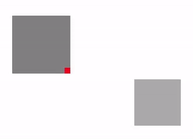

# Animations

LayoutKit supports animating between two layouts.

## Requirements

1. Use the `id` parameter to identify layouts involved in the animation.
2. Call `prepareAnimation()` on a `LayoutArrangement` to setup the existing view hierarchy for the animation.
3. Call `apply()` on the animation object returned by `prepareAnimation()` inside of the UIKit animation block.

## Example playground

Here is a complete example that works in a playground:



```swift
mport UIKit
import XCPlayground
import LayoutKit

// The initial layout.
let before = InsetLayout(
    inset: 30,
    sublayout: StackLayout(
        axis: .vertical,
        distribution: .fillEqualSpacing,
        sublayouts: [
            SizeLayout<UIView>(
                width: 100,
                height: 100,
                alignment: .topLeading,
                id: "bigSquare",
                sublayout: SizeLayout<UIView>(
                    width: 10,
                    height: 10,
                    alignment: .bottomTrailing,
                    id: "redSquare",
                    config: { view in
                        view.backgroundColor = UIColor.redColor()
                    }
                ),
                config: { view in
                    view.backgroundColor = UIColor.grayColor()
                }
            ),
            SizeLayout<UIView>(
                width: 80,
                height: 80,
                alignment: .bottomTrailing,
                id: "littleSquare",
                config: { view in
                    view.backgroundColor = UIColor.lightGrayColor()
                }
            )
        ]
    )
)

// The final layout.
let after = InsetLayout(
    inset: 30,
    sublayout: StackLayout(
        axis: .vertical,
        distribution: .fillEqualSpacing,
        sublayouts: [
            SizeLayout<UIView>(
                width: 100,
                height: 100,
                alignment: .topLeading,
                id: "bigSquare",
                config: { view in
                    view.backgroundColor = UIColor.grayColor()
                }
            ),
            SizeLayout<UIView>(
                width: 50,
                height: 50,
                alignment: .bottomTrailing,
                id: "littleSquare",
                sublayout: SizeLayout<UIView>(
                    width: 20,
                    height: 20,
                    alignment: .topLeading,
                    id: "redSquare",
                    config: { view in
                        view.backgroundColor = UIColor.redColor()
                    }
                ),
                config: { view in
                    view.backgroundColor = UIColor.lightGrayColor()
                }
            )
        ]
    )
)

// Setup a root view.
let rootView = UIView(frame: CGRect(x: 0, y: 0, width: 350, height: 250))
rootView.backgroundColor = UIColor.whiteColor()
XCPlaygroundPage.currentPage.liveView = rootView

// Apply the initial layout.
before.arrangement(width: 350, height: 250).makeViews(inView: rootView)

// Prepare the animation to the final layout.
let animation = after.arrangement(width: 350, height: 250).prepareAnimation(for: rootView, direction: .RightToLeft)

// Perform the animation.
UIView.animateWithDuration(5.0, delay: 2.0, options: [], animations: {
    animation.apply()
}, completion: { (_) in
    XCPlaygroundPage.currentPage.finishExecution()
})
```
